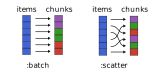

# ChunkSplitters.jl

[ChunkSplitters.jl](https://github.com/m3g/ChunkSplitters.jl) facilitates the splitting of a given list of work items (of potentially uneven workload) into chunks that can be readily used for parallel processing. Operations on these chunks can, for example, be parallelized with Julia's multithreading tools, where separate tasks are created for each chunk. Compared to naive parallelization, ChunkSplitters.jl therefore effectively allows for more fine-grained control of the composition and workload of each parallel task.

Working with chunks and their respective indices also improves thread-safety compared to a naive approach based on `threadid()` indexing (see [PSA: Thread-local state is no longer recommended](https://julialang.org/blog/2023/07/PSA-dont-use-threadid/)). 

!!! compat
    In ChunkSplitters version 2.1 the iteration with `chunks` returns the ranges of indices only. To retrieve
    the chunk indices, use `enumerate(chunks(...))`. Additionally, the number of chunks and the split type
    of chunks are assigned with keyword arguments `n`, and `split`.  

    This change is not breaking because the legacy interface (of version 2.0) is still valid, although it
    is no longer documented and will be deprecated in version 3.0.

## Installation

Install with:
```julia-repl
julia> import Pkg; Pkg.add("ChunkSplitters")
```

## The `chunks` iterator

The main interface is the `chunks` iterator, and the enumeration of chunks, with `enumerate`.

```julia
chunks(array::AbstractArray; n::Int, split::Symbol=:batch)
```
This iterator returns a vector of ranges which indicates the range of indices of the input `array` for each given chunk. The `split` parameter is optional. If `split == :batch`, the ranges are consecutive (default behavior). If `split == :scatter`, the range is scattered over the array.

The different chunking variants are illustrated in the following figure: 



For `split=:batch`, each chunk is "filled up" with work items one after another such that all chunks hold approximately the same number of work items (as far as possible). For `split=:scatter`, the work items are assigned to chunks in a round-robin fashion. As shown below, this way of chunking can be beneficial if the workload (i.e. the computational weight) for different items is uneven. 

## Basic interface

Let's first illustrate the chunks returned by `chunks` for the different chunking variants:

```jldoctest
julia> using ChunkSplitters

julia> x = rand(7);

julia> for inds in chunks(x; n=3, split=:batch)
           @show inds
       end
inds = 1:1:3
inds = 4:1:5
inds = 6:1:7

julia> for inds in chunks(x; n=3, split=:scatter)
           @show inds
       end
inds = 1:3:7
inds = 2:3:5
inds = 3:3:6
```

The chunk indices can be retrieved with the `enumerate` function, which is specialized
for the ChunkSplitters structure such that it works with `@threads`: 

```jldoctest
julia> using ChunkSplitters, Base.Threads

julia> x = rand(7);

julia> @threads for (ichunk, inds) in enumerate(chunks(x; n=3))
           @show ichunk, inds
       end
(ichunk, inds) = (1, 1:1:3)
(ichunk, inds) = (2, 4:1:5)
(ichunk, inds) = (3, 6:1:7)
```

## Simple multi-threaded example

Now, let's demonstrate how to use chunks in a simple multi-threaded example:

```julia-repl
julia> using BenchmarkTools

julia> using ChunkSplitters

julia> function sum_parallel(f, x; n=Threads.nthreads())
           t = map(chunks(x; n=n)) do inds
               Threads.@spawn sum(f, @view x[inds])
           end
           return sum(fetch.(t))
       end

julia> x = rand(10^8);

julia> Threads.nthreads()
12

julia> @btime sum(x -> log(x)^7, $x);
  1.353 s (0 allocations: 0 bytes)

julia> @btime sum_parallel(x -> log(x)^7, $x; n=Threads.nthreads());
  120.429 ms (98 allocations: 7.42 KiB)
```
Of course, `chunks` can also be used in conjunction with `@threads` (see below).

## Shared buffers: using enumerate

If shared buffers are required, the enumeration of the buffers by
chunk using `enumerate` is useful, to avoid using the id of the thread. For example,
here we accumulate intermediate results of the sum in an array
`chunk_sums` of length `n`, which is later reduced:

A simple `@threads`-based example:
```jldoctest
julia> using ChunkSplitters, Base.Threads

julia> x = collect(1:10^5);

julia> n = nthreads();

julia> chunk_sums = zeros(Int, n);

julia> @threads for (ichunk, inds) in enumerate(chunks(x; n=n))
           chunk_sums[ichunk] += sum(@view x[inds])
       end

julia> sum(chunk_sums)
5000050000
```

!!! warning
    Using shared buffers like this can lead to performance issues caused by *false-sharing*:
    A thread writes to the buffer, invalidates the cache-line for other threads, and thus causes expensive restoration of [cache coherence](https://en.wikipedia.org/wiki/Cache_coherence).
    The example above intends to illustrate the syntax to be used to index the buffers, rather than
    to suggest this a an optimal pattern for parallelization. 

## Lower-level `getchunk` function 

The package also provides a lower-level `getchunk` function:
```julia-repl
getchunk(array::AbstractArray, ichunk::Int; n::Int, split::Symbol=:batch)
```
that returns the range of indices corresponding to the work items in the input `array` that are associated with chunk number `ichunk`. 

For example, if we have an array of 7 elements, and the work on the elements is divided
into 3 chunks, we have (using the default `split == :batch` option):

```jldoctest
julia> using ChunkSplitters

julia> x = rand(7);

julia> getchunk(x, 1; n=3)
1:1:3

julia> getchunk(x, 2; n=3)
4:1:5

julia> getchunk(x, 3; n=3)
6:1:7
```

And using `split = :scatter`, we have:

```jldoctest
julia> using ChunkSplitters 

julia> x = rand(7);

julia> getchunk(x, 1; n=3, split=:scatter)
1:3:7

julia> getchunk(x, 2; n=3, split=:scatter)
2:3:5

julia> getchunk(x, 3; n=3, split=:scatter)
3:3:6
```

### Example: `getchunk` usage

```julia-repl
julia> using BenchmarkTools

julia> using ChunkSplitters

julia> function sum_parallel_getchunk(f, x; n=Threads.nthreads())
           t = map(1:n) do ichunk
               Threads.@spawn begin
                   local inds = getchunk(x, ichunk; n=n)
                   sum(f, @view x[inds])
               end
           end
           return sum(fetch.(t))
       end

julia> x = rand(10^8);

julia> Threads.nthreads()
12

julia> @btime sum(x -> log(x)^7, $x);
  1.363 s (0 allocations: 0 bytes)

julia> @btime sum_parallel_getchunk(x -> log(x)^7, $x; n=Threads.nthreads());
  121.651 ms (100 allocations: 7.31 KiB)
```
